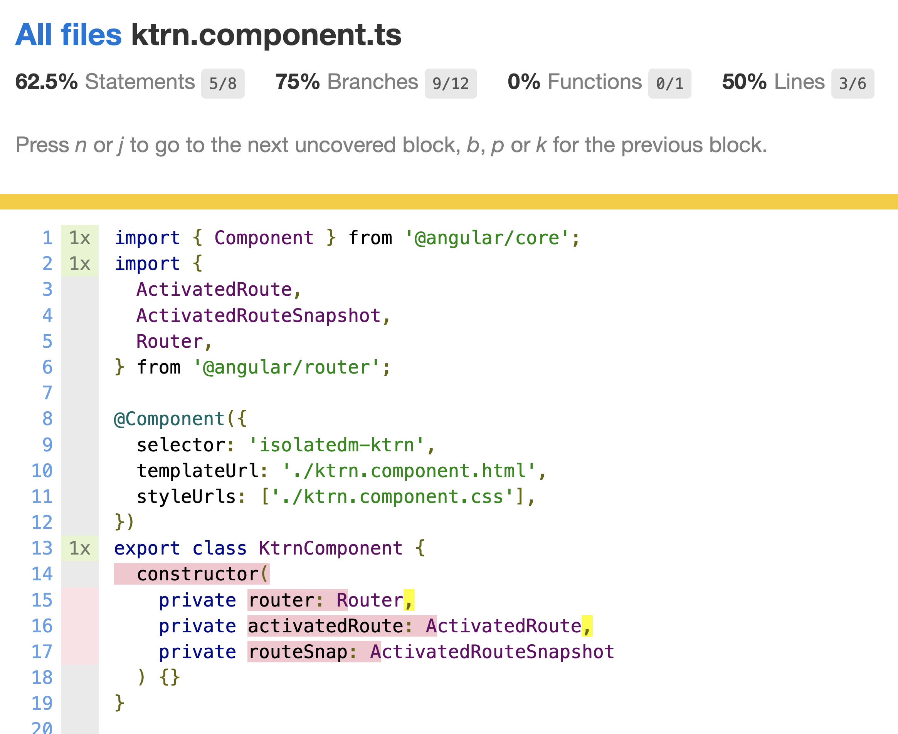
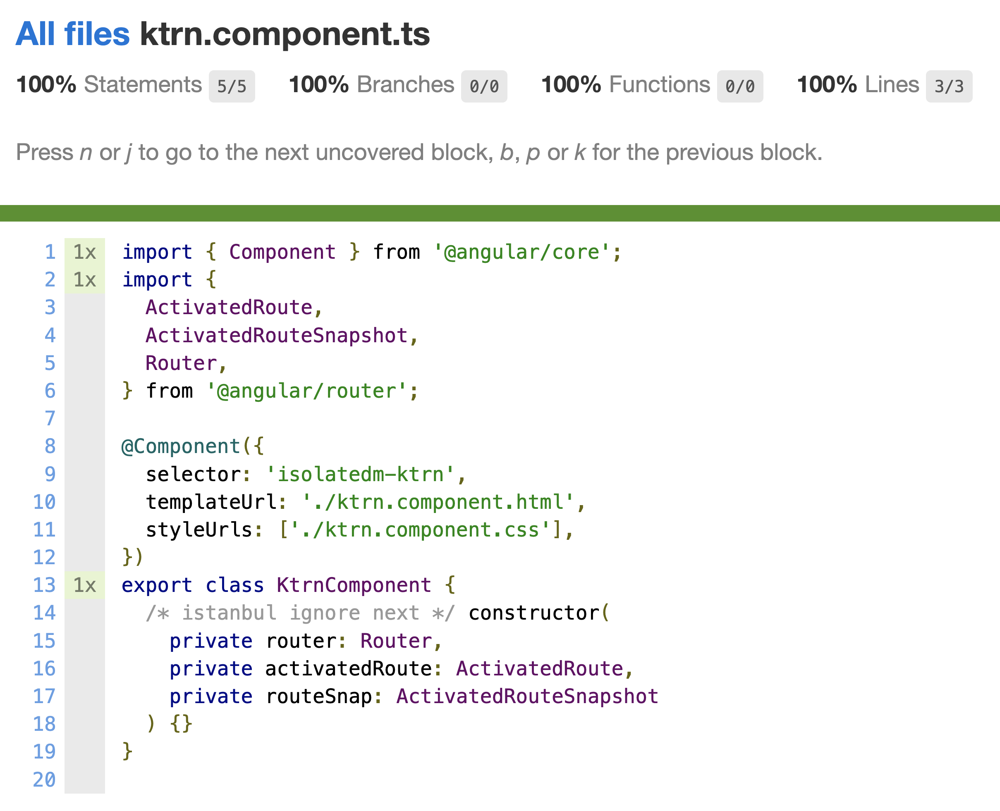

# Branch coverage bug for `isolatedModules: true`

This project was generated using [Nx](https://nx.dev).

Run `npx nx test katerina` from root

It's using code from [Nx](https://github.com/nrwl/nx), and also code found in these comments by [micalevisk](https://github.com/micalevisk) and [vad3x](https://github.com/vad3x):

- https://github.com/istanbuljs/istanbuljs/issues/70#issuecomment-1116051398
- https://github.com/istanbuljs/istanbuljs/issues/70#issuecomment-975654329
- https://github.com/kulshekhar/ts-jest/issues/1166#issuecomment-975650682

Lots of credit also to:

- [barbados-clemens](https://github.com/barbados-clemens)
- [cammisuli](https://github.com/cammisuli)
- [jaysoo](https://github.com/jaysoo)

## Try it out locally

1. Clone this repo
2. `yarn` to install dependencies
3. `npx nx test katerina --coverage`

## Constructor parameters counting as branches

When using `isolatedModules: true` there's a bug in `istanbul` and/or `ts-jest` that considers the decorated parameters as branches. The bug is described in these issues: https://github.com/kulshekhar/ts-jest/issues/1166, https://github.com/istanbuljs/istanbuljs/issues/70.

This is due to the way istanbul/ts-jest build/create the output for the code to be tested. Let's take a look at what the actual [component code](libs/katerina/src/lib/ktrn/ktrn.component.ts) looks like, and then what the ts-jest/istanbul generated code looks like:

### Part of the component code

```
@Component({
  selector: 'isolatedm-ktrn',
  templateUrl: './ktrn.component.html',
  styleUrls: ['./ktrn.component.css'],
})
export class KtrnComponent {
  constructor(
    private router: Router,
    private activatedRoute: ActivatedRoute,
    private routeSnap: ActivatedRouteSnapshot
  ) {}
}

```

### Part of the generated/tested code

```
/* istanbul ignore next */
cov_2hjx6r85nd().s[11]++;
KtrnComponent = (0, tslib_1.__decorate)([(0, core_1.Component)({
  selector: 'isolatedm-ktrn',
  template: require("./ktrn.component.html")
}), (0, tslib_1.__metadata)("design:paramtypes", [typeof (_a =
/* istanbul ignore next */
(cov_2hjx6r85nd().b[1][0]++, typeof router_1.Router !== "undefined") &&
/* istanbul ignore next */
(cov_2hjx6r85nd().b[1][1]++, router_1.Router)) === "function" ?
/* istanbul ignore next */
(cov_2hjx6r85nd().b[0][0]++, _a) :
/* istanbul ignore next */
(cov_2hjx6r85nd().b[0][1]++, Object), typeof (_b =
/* istanbul ignore next */
(cov_2hjx6r85nd().b[3][0]++, typeof router_1.ActivatedRoute !== "undefined") &&
/* istanbul ignore next */
(cov_2hjx6r85nd().b[3][1]++, router_1.ActivatedRoute)) === "function" ?
/* istanbul ignore next */
(cov_2hjx6r85nd().b[2][0]++, _b) :
/* istanbul ignore next */
(cov_2hjx6r85nd().b[2][1]++, Object), typeof (_c =
/* istanbul ignore next */
(cov_2hjx6r85nd().b[5][0]++, typeof router_1.ActivatedRouteSnapshot !== "undefined") &&
/* istanbul ignore next */
(cov_2hjx6r85nd().b[5][1]++, router_1.ActivatedRouteSnapshot)) === "function" ?
/* istanbul ignore next */
(cov_2hjx6r85nd().b[4][0]++, _c) :
/* istanbul ignore next */
(cov_2hjx6r85nd().b[4][1]++, Object)])], KtrnComponent);

```

## Reproduce the bug locally:

First of all, you want to remove the "fix", first, to see how it looks before the "fix.

Go to `jest.preset.js` and remove the `transform`:

```
- transform: {
-    '^.+\\.(ts|mjs|js|html)$': path.join(
-      __dirname,
-      'fix-istanbul-decorators.js'
-    ),
-  },
```

Then try it out:

1. `npx jest --clear-cache`
2. `npx nx test katerina --skipNxCache --coverage`
3. Now you can see the generated code in your `jest` cache directory. To find this directory you can do
   `npx jest --show-config`, look for `cacheDirectory`, then open this directory in your code editor/IDE, and then do a search for `KtrnComponent`.
4. Then open the coverage result and see the result (`coverage/libs/katerina/index.html`).



## Applying the fix with the script

### What the script does

The [script](fix-istanbul-decorators.js) essentially does two things:

1. It dynamically adds `/* istanbul ignore next */` before every constructor found inside a `.component.ts` file
2. It adds `/* istanbul ignore next */` before every single constructor parameter in the **generated** code.
3. It adds `/* istanbul ignore next */` before decorators on methods and properties (ref: https://github.com/istanbuljs/istanbuljs/issues/70#issuecomment-1116051398, https://github.com/istanbuljs/istanbuljs/issues/70#issuecomment-975654329, https://github.com/kulshekhar/ts-jest/issues/1166#issuecomment-975650682)
4. When constructor parameters have decorated properties (eg @inject), TS adds a typeof branch check, which we don't want to instrument (ref: https://github.com/istanbuljs/istanbuljs/issues/70#issuecomment-1116051398, https://github.com/istanbuljs/istanbuljs/issues/70#issuecomment-975654329, https://github.com/kulshekhar/ts-jest/issues/1166#issuecomment-975650682)

[Here is the documentation](https://github.com/gotwarlost/istanbul/blob/master/ignoring-code-for-coverage.md) for ignoring things in istanbul. In our case, with the `isolatedModule: true`, the generated code results in a number of ternary expressions for each parameter. For that reason, we need to make sure we add the `ignore next` before each one of these ternary expressions, and not **just** ingore the `decorators` and the metadata/paramtypes.

In our script, we are using the TypeScript AST to parse the file, and identify these `ConditionalExpression`s, which are within our constructor of course.

### The results

The resulting generated code, after the replacements are in place, looks, now, like this:

```
/* istanbul ignore next */
cov_2hjx6r85nd().s[8]++;
KtrnComponent = (0, tslib_1.
/* istanbul ignore next */
__decorate)([(0, core_1.Component)({
  selector: 'isolatedm-ktrn',
  template: require("./ktrn.component.html")
}), (0, tslib_1.
/* istanbul ignore next */
__metadata)("design:paramtypes",
/* istanbul ignore next */
[
/* istanbul ignore next */
typeof (_a = typeof router_1.Router !== "undefined" && router_1.Router) === "function" ? _a : Object,
/* istanbul ignore next */
typeof (_b = typeof router_1.ActivatedRoute !== "undefined" && router_1.ActivatedRoute) === "function" ? _b : Object,
/* istanbul ignore next */
typeof (_c = typeof router_1.ActivatedRouteSnapshot !== "undefined" && router_1.ActivatedRouteSnapshot) === "function" ? _c : Object])], KtrnComponent);
```

Compare this with the result above, before ignoring the ternary experssions.

Now our coverage is fixed:



## Reproduce the fix locally:

First of all, you want to add the `transform` back.

Go to `jest.preset.js` and re-add the `transform`:

```
+ transform: {
+    '^.+\\.(ts|mjs|js|html)$': path.join(
+      __dirname,
+      'fix-istanbul-decorators.js'
+    ),
+  },
```

Then try it out:

1. `npx jest --clear-cache`
2. `npx nx test katerina --skipNxCache --coverage`
3. Now you can see the generated code in your `jest` cache directory. To find this directory you can do
   `npx jest --show-config`, look for `cacheDirectory`, then open this directory in your code editor/IDE, and then do a search for `KtrnComponent`.
4. Then open the coverage result and see the result (`coverage/libs/katerina/index.html`).

## Where is `jest-preset-angular`?

You may have noticed that [I removed](https://github.com/mandarini/isolatedm-jest/commit/e4a46cc8b26555e48a522815114d1cfc83e1923a) the project-level `transform` from `apps/web/jest.config.js` and `libs/katerina/jest.config.js`. That transform is needed because we need to apply `'jest-preset-angular'` to all the files. However, in this case, when using the script, we are actually using `'jest-preset-angular'` inside the [root-level transform script](fix-istanbul-decorators.js#L14):

```
const { default: tsJest } = require('jest-preset-angular');
```

That way, the `transformer` on line 20 is already the `'jest-preset-angular'` transformer.
